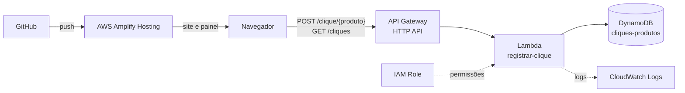

# Contador de cliques por produto na AWS

Arquitetura serverless na AWS que registra quantos cliques cada produto de um carrossel recebeu e disponibiliza os totais em um painel com gráficos, atualizado quase em tempo real.

O foco deste repositório é a infraestrutura na AWS. O site (Vite + Bootstrap) é só o cliente que consome a API, e as alterações feitas nele estão na seção [Alterações no site](#alterações-no-site).

## Sumário

- [Arquitetura](#arquitetura)
- [Serviços AWS utilizados](#serviços-aws-utilizados)
- [Modelo de dados](#modelo-de-dados)
- [API](#api)
- [Função Lambda](#função-lambda)
- [Permissões (IAM)](#permissões-iam)
- [Alterações no site](#alterações-no-site)
- [Como implantar](#como-implantar)
- [Como testar](#como-testar)
- [Custos](#custos)
- [Segurança](#segurança)
- [Melhorias futuras](#melhorias-futuras)
- [Estrutura do repositório](#estrutura-do-repositório)

## Arquitetura



**Fluxo do clique:** o visitante clica em "Ver Detalhes". O navegador envia um `POST` para o API Gateway, que aciona a Lambda. A Lambda incrementa dois contadores no DynamoDB: o total do produto e o total da hora atual.

**Fluxo do painel:** a página do painel consulta `GET /cliques` a cada 5 segundos, lê todos os contadores e desenha os gráficos.

## Serviços AWS utilizados

| Serviço | Função no projeto | Configuração |
|---|---|---|
| **Amazon DynamoDB** | Armazena os contadores | Tabela `cliques-produtos`, modo sob demanda (`PAY_PER_REQUEST`) |
| **AWS Lambda** | Registra cliques e lista os totais | `registrar-clique`, Python 3.12, 128 MB, timeout de 3 s |
| **Amazon API Gateway** | Expõe a API HTTP publicamente | HTTP API `api-cliques`, estágio `$default` com implantação automática, CORS configurado |
| **AWS IAM** | Permissões da Lambda | Role com acesso mínimo à tabela e escrita de logs |
| **Amazon CloudWatch Logs** | Logs da Lambda | Grupo `/aws/lambda/registrar-clique`, retenção de 7 dias |
| **AWS Amplify Hosting** | Build e hospedagem do site e do painel | Conectado ao GitHub, branch `main`, build `npm run build`, saída em `dist` |
| **AWS CloudShell** | Testes manuais da API com `curl` | Uso opcional, não faz parte da infraestrutura |
| **AWS Cost Explorer / AWS Budgets** | Acompanhamento de custos e alertas | Configurados no console de Billing, fora do Terraform |

Por baixo, o Amplify Hosting usa S3 e CloudFront para entregar o site.

Região utilizada: **us-east-2 (Ohio)**.

## Modelo de dados

Tabela `cliques-produtos`:

| Atributo | Tipo | Papel |
|---|---|---|
| `produto` | String | Chave de partição (ex.: `comoda-azul`) |
| `periodo` | String | Chave de classificação: `TOTAL` ou a hora no formato `AAAA-MM-DDTHH` (horário de Brasília) |
| `cliques` | Número | Contador, incrementado com `ADD` (operação atômica) |

Exemplo de itens:

| produto | periodo | cliques |
|---|---|---|
| comoda-azul | TOTAL | 5 |
| comoda-azul | 2026-10-07T16 | 2 |
| comoda-azul | 2026-10-07T17 | 2 |
| comoda-azul | 2026-10-07T18 | 1 |

Cada clique gera duas atualizações: uma no item `TOTAL` e outra no item da hora atual. O item `TOTAL` alimenta os cartões e o gráfico de barras, e os itens por hora alimentam o gráfico de linhas.

Os produtos aceitos são `comoda-madeira`, `comoda-azul` e `comoda-vintage`.

## API

Todas as rotas usam a URL base da API, exibida no output `api_url` do Terraform ou no estágio `$default` do API Gateway.

| Método | Rota | Descrição |
|---|---|---|
| `POST` | `/clique/{produto}` | Registra um clique no produto informado |
| `GET` | `/cliques` | Lista todos os contadores (totais e por hora) |

**Registrar clique**

```bash
curl -X POST https://SEU_API_URL/clique/comoda-azul
```

```json
{ "ok": true, "produto": "comoda-azul" }
```

**Listar contadores**

```bash
curl https://SEU_API_URL/cliques
```

```json
[
  { "produto": "comoda-azul", "periodo": "TOTAL", "cliques": 5 },
  { "produto": "comoda-azul", "periodo": "2026-10-07T16", "cliques": 2 }
]
```

**Respostas de erro**

| Código | Quando acontece |
|---|---|
| `400` | Produto fora da lista permitida (`{"erro": "produto inválido"}`) |
| `404` | Rota inexistente (`{"erro": "rota não encontrada"}`) |

A integração entre o API Gateway e a Lambda usa o **formato de payload 2.0**. O código depende dele, porque identifica a rota pelo campo `routeKey`.

## Função Lambda

Arquivo: [`AWS/lambda_function.py`](AWS/lambda_function.py)

- **Handler:** `lambda_function.lambda_handler`
- **Variável de ambiente:** `TABELA`, com o nome da tabela do DynamoDB.
- **Validação:** só aceita os produtos da lista `PRODUTOS`. Isso impede que alguém crie itens arbitrários na tabela.
- **Horário:** as chaves por hora usam o horário de Brasília (UTC-3).
- **CORS:** a Lambda não devolve cabeçalhos de CORS. Quando o CORS está configurado na API, o API Gateway ignora os cabeçalhos do backend, então o controle fica só no API Gateway.

## Permissões (IAM)

A role da Lambda tem duas políticas:

1. `AWSLambdaBasicExecutionRole` (gerenciada pela AWS): permite gravar logs no CloudWatch.
2. Política própria, restrita ao ARN da tabela, com apenas estas ações:
   - `dynamodb:UpdateItem`, para incrementar os contadores.
   - `dynamodb:Scan`, para listar os contadores no painel.

## Alterações no site

O site é um projeto Vite. Estes são os únicos arquivos alterados para integrar com a AWS.

**1. `src/index.html`**: cada botão do carrossel recebe o atributo `data-produto`, com o mesmo identificador aceito pela Lambda.

```html
<a href="1_produto-comoda.html" class="btn btn-primary" data-produto="comoda-madeira">Ver Detalhes</a>
```

**2. `src/assets/js/custom.js`**: envia o clique à API. O evento é escutado no `document` porque o Swiper pode duplicar os slides, e as cópias não herdam eventos. O `keepalive: true` mantém a requisição ativa mesmo quando a página muda.

```js
const API_URL = "https://SEU_API_URL";

document.addEventListener("click", (e) => {
  const botao = e.target.closest("[data-produto]");
  if (!botao) return;
  fetch(`${API_URL}/clique/${botao.dataset.produto}`, {
    method: "POST",
    keepalive: true,
  }).catch(() => {});
});
```

**3. `src/public/painel.html`**: página independente do painel, com Chart.js. Consulta `GET /cliques` a cada 5 segundos, pausa quando a aba está escondida e mostra os totais, o gráfico de barras e os cliques por hora das últimas 12 horas. A constante `API_URL` no início do script também precisa apontar para a sua API. A pasta `public` é copiada como está para o site publicado.

**Rodar o site localmente** (Node.js 18+):

```bash
npm install
npm run dev     # http://localhost:3000
npm run build   # gera /dist
```

Stack do site: Vite, Bootstrap 5, Bootstrap Icons, Swiper e Sass. Demo: https://giovanalima07.github.io/Contador-de-cliques-landing-page/index.html

## Como implantar

### Opção A: Terraform (recomendado)

Os arquivos estão na pasta [`AWS/`](AWS/) e criam DynamoDB, IAM, Lambda, grupo de logs e API Gateway (rotas, integração, permissão e estágio). O Amplify e o Cost Explorer são configurados à parte, no console.

**Pré-requisitos**

- Terraform 1.0 ou superior.
- AWS CLI configurado (`aws configure`) com um usuário do IAM com permissão para criar esses recursos. Não use a conta raiz.

**Variáveis**

| Variável | Padrão | Descrição |
|---|---|---|
| `project_name` | `contador-cliques` | Prefixo dos nomes da role e da política |
| `allowed_origins` | `["*"]` | Origens autorizadas no CORS. Em produção, restrinja aos endereços do site |

Exemplo de `terraform.tfvars` (não versione este arquivo):

```hcl
allowed_origins = [
  "https://main.SEU_APP.amplifyapp.com",
  "https://SEU_USUARIO.github.io",
]
```

**Comandos**

```bash
cd AWS
terraform init
terraform plan
terraform apply
```

Ao final, o output `api_url` mostra a URL da API. Copie-a para a constante `API_URL` do `custom.js` e do `painel.html`.

> **Atenção:** os nomes dos recursos (tabela `cliques-produtos`, função `registrar-clique`) são fixos. Em uma conta e região onde eles já existem, o `apply` falha por conflito. Para testar, altere a região no bloco `provider` ou use outra conta, e remova depois com `terraform destroy`.

**Remover tudo**

```bash
terraform destroy
```

### Opção B: console da AWS

O projeto original foi montado pelo console, nesta ordem:

1. **DynamoDB:** criar a tabela `cliques-produtos` (chave de partição `produto`, chave de classificação `periodo`, modo sob demanda).
2. **Lambda:** criar a função `registrar-clique` (Python 3.12), colar o código, fazer o *Deploy* e adicionar à role uma política em linha com `UpdateItem` e `Scan` na tabela.
3. **API Gateway:** criar uma HTTP API com a integração Lambda, as rotas `POST /clique/{produto}` e `GET /cliques`, estágio `$default` e o CORS configurado.
4. **Amplify Hosting:** conectar o repositório do GitHub, branch `main`, e confirmar o build `npm run build` com saída em `dist`.
5. **Site:** atualizar `API_URL` no `custom.js` e no `painel.html`.

## Como testar

No Linux, macOS ou CloudShell:

```bash
curl -X POST https://SEU_API_URL/clique/comoda-azul
curl https://SEU_API_URL/cliques
```

No PowerShell, use `curl.exe` no lugar de `curl`.

Depois, abra o site, clique em "Ver Detalhes" e confira se o total do produto aumentou em 1. No painel (`/painel.html`), os números devem se atualizar em até 5 segundos.

## Custos

Estimativa mensal para **1.000 cliques por dia** (30 mil por mês), em dólares, na região de Ohio e **sem considerar o nível gratuito**:

| Parte | Base do cálculo | Custo aproximado |
|---|---|---|
| Contagem dos cliques | API Gateway, Lambda e 2 gravações no DynamoDB por clique | ~ US$ 0,09 |
| Painel aberto 24h | ~ 518 mil consultas por mês (a cada 5 s) | até ~ US$ 2,50 |
| Site no Amplify | 1.000 visitantes por dia, de 2 a 4,3 MB cada | US$ 7 a US$ 17 |
| **Total** | | **US$ 9 a US$ 20** |

O maior custo é a transferência de dados do site, e não o contador. Para reduzi-lo, otimize as imagens do carrossel (por exemplo, WebP). O painel pausa quando a aba está escondida, e aumentar o intervalo de atualização de 5 para 30 segundos reduz o custo das consultas em 6 vezes.

Os preços mudam, então confirme os valores atuais no **AWS Pricing Calculator**. Para acompanhar o gasto real, use o **Cost Explorer**, e para limitar o gasto, crie um alerta no **AWS Budgets**.

## Segurança

- **Permissões mínimas:** a Lambda só pode executar `UpdateItem` e `Scan` na tabela do projeto.
- **Validação de entrada:** produtos fora da lista recebem erro `400`.
- **CORS:** restrinja `allowed_origins` aos endereços do site. O padrão `*` aceita qualquer origem.
- **Rota pública:** `GET /cliques` não exige login. Quem tiver a URL consegue ler os totais.
- **Credenciais:** nunca versione chaves da AWS, o arquivo `terraform.tfvars` nem o estado do Terraform (`*.tfstate`). Eles estão no `.gitignore`.

## Melhorias futuras

- **Amazon Cognito:** exigir login na rota `GET /cliques`, para que só o cliente veja o painel.
- **Leitura mais eficiente:** trocar o `Scan` por `Query` das últimas horas, ou aplicar TTL (expiração automática) aos itens por hora. Com o tempo, a tabela cresce e cada `Scan` fica mais caro.
- **Limite de requisições:** configurar *throttling* no estágio da API para reduzir o risco de abuso.
- **Atualização em tempo real:** substituir o *polling* por DynamoDB Streams com API Gateway WebSocket.
- **Estado remoto do Terraform:** guardar o `tfstate` em um bucket S3 com bloqueio no DynamoDB, para trabalho em equipe.
- **Orçamento como código:** criar o alerta de custos com `aws_budgets_budget` no próprio Terraform.

## Estrutura do repositório

```
.
├── AWS/
│   ├── main.tf                # infraestrutura (Terraform)
│   └── lambda_function.py     # código da função Lambda
├── src/
│   ├── index.html             # botões com data-produto
│   ├── assets/js/custom.js    # envia o clique à API
│   └── public/painel.html     # painel de cliques
├── package.json
├── vite.config.js
└── README.md
```